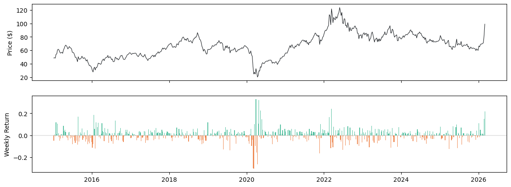
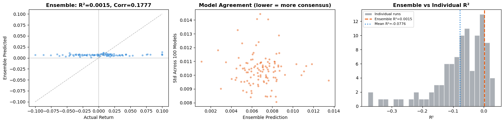
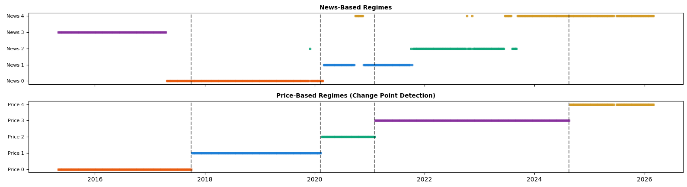
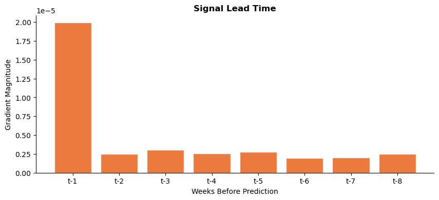

# Can We Predict Oil Prices? (With Deep Learning)

**Hyundam Choi · Hazel Choi** — March 2026 · [Slides (PDF)](JSIS%20presentation%20v2.pdf) · [Notebook](oil_signal_discovery_v7_final.ipynb)

Oil prices react to wars, OPEC decisions, pandemics, and the economy, and all of those events are covered in the news. This project asks whether a deep learning model can read the emotional tone and themes of global news and use them to predict next week's Brent crude return.

We trained a Transformer on about 3,000 emotion and theme scores computed from **1.06 billion news articles** (2015–2026), repeated the training 100 times, and averaged the 100 models.

## TL;DR

- **Prediction failed.** The 100-model ensemble scored R² = 0.0015 and 52.7% direction accuracy on 2024–2026 test weeks, no better than guessing.
- **But the model recognized market regimes.** Grouping weeks by the model's internal view of the news (plus a few market indicators) splits 2015–2026 into five periods that line up with the structural breaks in the oil price itself (Adjusted Rand Index 0.56).
- **If news matters, it matters within a week.** The most recent week carries about 8× the influence of an average earlier week, which suggests news and prices react to the same events at the same time rather than news leading prices.
- **Extreme price weeks have a news fingerprint.** Oil vocabulary spikes in both crashes and rallies, the language turns less pleasant in both, negative-sentiment words drop during crashes, and polarization and helplessness language rises during rallies.

## Background

Oil prices move with many forces at once, some hidden and some with delayed effects:

| Supply factors | Demand factors | External shocks |
|---|---|---|
| Production decisions | Global economic growth | Extreme weather |
| Geopolitical conflicts and wars | Industrial activity | Financial speculation in energy markets |
| Pipeline or shipping disruptions | Seasonal energy consumption | Government policies and regulations |

That makes oil prices close to impossible to predict, but it is also the kind of problem where deep learning, which can weigh thousands of variables at once, might find patterns people miss. We tested that idea with a **Transformer**, the same attention-based architecture behind modern language models, scaled down to about 76,000 parameters.

## Data

### Target: Brent crude oil prices

- Weekly closing prices of Brent crude futures (`BZ=F`) from Yahoo Finance, **583 weeks** from 2015-01-05 to 2026-03-02.
- The model predicts the **next week's return** (percent change week over week). For training, returns were clipped to ±10%, which affected 35 extreme weeks.



### Inputs: news tone from GDELT GCAM

- **GDELT** (Global Database of Events, Language, and Tone) is an open platform that processes news articles from around the world in real time.
- Its **GCAM** (Global Content Analysis Measures) layer runs dozens of emotion and theme dictionaries over every article and scores it on about 3,000 dimensions, such as *surprise*, *confusion*, or *hostility*. An article about a war, for example, scores high on *hostility* and *conflict* and low on *peaceful*.
- We queried GDELT's public BigQuery table (`gdelt-bq.gdeltv2.gkg_partitioned`) for articles tagged with any of more than 100 themes on energy, conflict, the economy, politics, and disasters, then averaged every GCAM dimension by week: **2,962 dimensions × 576 weeks from 1,056,029,354 articles.**
- **Market context:** the last two weeks' Brent returns, 4-week volatility, the S&P 500 weekly return, the US Dollar Index weekly return, and the VIX level.

## Method

1. **Scale and compress.** Standardize the 2,963 weekly news features (2,962 GCAM dimensions plus the weekly article count), then reduce them to **100 principal components**, which keep 88.3% of the variance. Both steps are fit on training weeks only.
2. **Add market context.** Append the 6 market features, for 106 features per week.
3. **Windows.** Each sample is the past **8 weeks** of features, and the label is the following week's return.
4. **Split by time.** Train on weeks before 2023 (400 samples), validate on 2023 (54), and test on January 2024 to March 2026 (112).
5. **Train 100 times.** Each run uses a different random seed, Huber loss (δ = 0.05), the AdamW optimizer, and early stopping on validation loss. The **ensemble** prediction is the average of the 100 models' predictions.

```
Input: 8 weeks × 106 features
  → Linear(106 → 64) + GELU + Dropout          # project each week into the model's working space
  → + sinusoidal positional encoding           # tell the model which week is which
  → Transformer encoder × 2                    # 4-head self-attention: weeks "look at" each other
  → take the last week's 64-number summary
  → Linear(64 → 32) + GELU + Dropout + Linear(32 → 1)
Output: next week's predicted return           # 75,905 parameters in total
```

Earlier versions of the notebook tried news-only inputs and an up/down classifier. In most runs the classifier collapsed into predicting "up" every week, so the final version predicts the return directly and adds the market features.

## Results: we couldn't predict weekly oil prices

| Metric (test set, 112 weeks) | 100-model ensemble | Single model (mean ± std of 100 runs) |
|---|---|---|
| R² | 0.0015 | −0.078 ± 0.088 |
| Correlation (predicted vs. actual) | 0.178 | 0.047 ± 0.085 |
| Direction accuracy | 52.7% | 51.9% ± 3.2% |
| RMSE (weekly return) | 0.0371 | 0.0385 ± 0.0015 |

- **R²:** how much of the week-to-week movement the model explains. 0 means no better than always predicting the average return, and a negative value means worse than that.
- **Direction accuracy:** how often the model got up vs. down right. 50% is a coin flip.

Averaging 100 models pulled R² from negative to just above zero, but the ensemble ends up predicting a small positive return (about +0.1% to +1.4%) every single week. Its 52.7% direction accuracy is therefore exactly the share of up weeks in the test period, the same score as always guessing "up".



**Possible explanations**

- **The approach itself.** Concrete supply and demand figures might work better than emotional signals. Relying on sentiment plus a few market metrics was ambitious.
- **Not enough data.** Around a million news articles are published every day, so 1 billion articles is only about 1,000 days of global news.
- **Model quality.** A better or more complex architecture might do better.
- **The problem itself (most likely).** It may be impossible to model all the cause-and-effect relationships that move oil prices week to week.

However, the model still found some patterns.

## Findings

### 1. The model recognized the market's big regimes

- **News regimes:** for every week we took the trained model's internal 64-number summary of its inputs (100 news components plus 6 market features) and grouped the weeks into 5 clusters with k-means.
- **Price regimes:** separately, we ran kernel change-point detection on the Brent price alone, which found 4 structural breaks (Oct 2017, Feb 2020, Jan 2021, Aug 2024) and so 5 periods.

The two groupings line up. The news regimes switch close to the price breaks, with an **Adjusted Rand Index of 0.56** (1 = identical groupings, 0 = chance). In other words, the model could tell what kind of market it was in from how the world talks about it, even though it couldn't predict next week's price. One reason this can happen is that news and prices both reflect the same big events, such as wars and pandemics.



### 2. How quickly does news relate to oil price movements?

We measured how much each of the 8 input weeks influenced the prediction by computing how sensitive the output is to small changes in each week's data (the gradient of the output with respect to the input). The most recent week (t−1) dominates: its gradient is about **8× the average of the other seven weeks**, which are nearly flat.

Last week's news matters most, and anything older adds almost no information. This also suggests that news and oil prices react to events at the same time, rather than news leading prices.



### 3. Which news dimensions react most during price swings?

We defined **price swings** as the top and bottom 10% of weekly returns in the training period: crashes of −5.64% or worse and rallies of +5.65% or better, 41 weeks each. For each of the ~3,000 news dimensions, we measured how far its average in those weeks deviated from normal weeks, as a **z-score** (the number of standard deviations from the normal-week average). No model is involved in this step. Highlighted rows are discussed below the tables.

**During crashes**

| Rank | Dimension | Label | z | What it measures |
|---|---|---|---|---|
| 1 | c9.365 | UNCTUOUSNESS | +0.991 | Oil-related terms |
| 2 | c18.172 | ENV_OIL | +0.939 | Oil-related themes |
| 3 | c9.265 | SMOOTHNESS | +0.884 | Oil-related terms |
| 4 | c9.77 | DISPERSION | +0.857 | Oil-related terms |
| 5 | c23.22 | **Level3Negative** | −0.832 | Negative sentiment. It *decreases*: news may shift from emotional language to factual, urgent reporting |
| 6 | c23.24 | Level4Negative | −0.826 | Negative sentiment |
| 7 | c23.20 | Level2Negative | −0.822 | Negative sentiment |
| 8 | c18.290 | ECON_IDENTITYTHEFT | +0.821 | GDELT "economic crime / identity theft" theme |
| 9 | c9.366 | OIL | +0.814 | Oil-related terms |
| 10 | c23.18 | Level1Negative | −0.808 | Negative sentiment |
| 11 | v22.7 | Valence (Men) | −0.806 | How pleasant the news language feels, scored by men |
| 12 | c9.853 | ECONOMY | +0.787 | Economic language (intuitive during crashes) |
| 13 | c9.342 | LUBRICATION | +0.786 | Oil-related terms |
| 14 | v22.1 | **Valence (All)** | −0.777 | How pleasant the news language feels, scored by all genders |
| 15 | c2.10 | AUD | +0.775 | "Auditory" words (unclear) |

**During rallies**

| Rank | Dimension | Label | z | What it measures |
|---|---|---|---|---|
| 1 | c18.295 | **SOC_POLARIZED** | +1.287 | GDELT "social polarization" theme. Economic booms may amplify inequality debates |
| 2 | c9.365 | UNCTUOUSNESS | +1.220 | Oil-related terms |
| 3 | c18.172 | ENV_OIL | +1.173 | Oil-related themes |
| 4 | c9.366 | OIL | +1.116 | Oil-related terms |
| 5 | c9.342 | LUBRICATION | +0.947 | Oil-related terms |
| 6 | c9.271 | CLOSURE | +0.862 | Words about physical closing (unclear) |
| 7 | c2.42 | Decr | +0.860 | Words related to "decrease", e.g. "decline in unemployment"? (unclear) |
| 8 | v22.7 | Valence (Men) | −0.834 | How pleasant the news language feels, scored by men. Drops in both crashes and rallies |
| 9 | v22.1 | **Valence (All)** | −0.803 | How pleasant the news language feels, scored by all genders |
| 10 | v22.4 | Valence (Women) | −0.793 | How pleasant the news language feels, scored by women |
| 11 | c15.34 | **belonging** | +0.790 | "Belonging" emotion. Social bonding language may increase during booms |
| 12 | c9.265 | SMOOTHNESS | +0.785 | Oil-related terms |
| 13 | c9.853 | ECONOMY | +0.779 | Economic language |
| 14 | v22.6 | **Dominance (Women)** | −0.778 | How much the language conveys a sense of control, scored by women. Control drops during price surges |
| 15 | c15.143 | **helplessness** | +0.773 | Oil price surges may create a sense of powerlessness for consumers and importing nations |

<sub>Dimension codes are GCAM IDs. c9 = Roget's Thesaurus categories, c18 = GDELT themes, c23 = ML-SENTICON sentiment levels, v22 = Spanish ANEW valence and dominance scores, c15 = WordNet Affect, c2 = General Inquirer.</sub>

**What stands out**

- **Both crashes and rallies:** oil vocabulary spikes (big moves get more oil coverage in either direction), and the emotional pleasantness of news language drops across all gender groups. Even surges come with unease.
- **Crashes:** negative-sentiment words *decrease*. One explanation is that news shifts from emotional language to fact-focused reporting.
- **Rallies:** social polarization discourse increases, perhaps because economic booms amplify inequality debates. The sense of control decreases and helplessness increases.

## Additional statistical checks (notebook only)

Because the model's own predictions were weak, the notebook also tests each news dimension directly against oil returns, without the model, on the training period:

- **Granger causality** (do past values of a dimension improve the forecast beyond past returns alone?): 653 of 2,963 features were significant at p < 0.05, against about 148 expected by chance, but **none** survived a Bonferroni correction for testing so many features at once.
- **Spearman rank correlation** with weekly returns: 283 were nominally significant, and **none** survived a false-discovery-rate correction.

These checks agree with the main result. No single news dimension reliably leads weekly oil returns once multiple testing is taken into account.

## Summary

1. Deep learning, at least our model, could not predict weekly oil prices. However, the model's view of the news could identify the market's macro regimes.
2. If news affects oil prices, it happens within a week, and anything older adds almost no information.
3. Certain news dimensions react strongly during extreme price swings: less negative language during crashes, more polarization and helplessness during rallies, and less pleasant language in both.

## Limitations

- The model was trained on about 400 weeks, which is small by deep learning standards. A larger dataset could improve performance.
- A better or more complex architecture might do better, and the biggest limitation may be our algorithm itself.
- Everything is analyzed by week. Weekly data may be too coarse, and daily data could reveal sharper patterns.

## Repository contents

| File | Description |
|---|---|
| [`oil_signal_discovery_v7_final.ipynb`](oil_signal_discovery_v7_final.ipynb) | Full pipeline: data loading, PCA, Transformer, 100-run training and ensemble, regime and lead-time analysis, statistical checks |
| [`JSIS presentation v2.pdf`](JSIS%20presentation%20v2.pdf) | Presentation slides (21 slides) |
| [`figures/`](figures) | Charts used in this README, exported from the notebook |

## Reproducing

- **Prices:** Brent, S&P 500, US Dollar Index, and VIX are downloaded inside the notebook with `yfinance`.
- **News data:** the weekly GCAM file (`data/gdelt_gcam_weekly.csv`, about 72 MB) is not included. Run the BigQuery SQL in section 2 of the notebook and save the result to that path. The query covers 11 years of GDELT, so check BigQuery's cost estimate before running it.
- **Python packages:** `pandas`, `numpy`, `matplotlib`, `seaborn`, `scikit-learn`, `torch`, `yfinance`, `tqdm`, `scipy`, `statsmodels`, `ruptures`

## References

- U.S. Energy Information Administration. [What drives crude oil prices?](https://www.eia.gov/finance/markets/crudeoil/)
- ScienceDirect. [Unveiling the impact of geopolitical conflict on oil prices: A case study of the Russia-Ukraine War and its channels.](https://www.sciencedirect.com/science/article/abs/pii/S0140988323004541)
- ScienceDirect. [Crude oil price forecasting with multivariate selection, machine learning, and a nonlinear combination strategy.](https://www.sciencedirect.com/science/article/abs/pii/S0952197624016683)
- Liberty Street Economics. [A New Approach for Identifying Demand and Supply Shocks in the Oil Market.](https://libertystreeteconomics.newyorkfed.org/2013/03/a-new-approach-for-identifying-demand-and-supply-shocks-in-the-oil-market/)
- NewsCatcher. [60,000 AI-generated news articles are published every day.](https://www.newscatcherapi.com/blog-posts/60-000-ai-generated-news-articles-are-published-every-day)
- [The GDELT Project](https://www.gdeltproject.org/) and the [GCAM codebook](http://data.gdeltproject.org/documentation/GCAM-MASTER-CODEBOOK.TXT)
